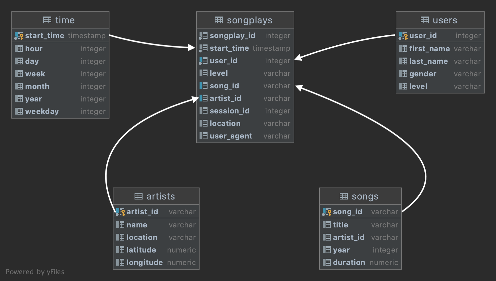

# Sparkify ETL

This project includes a simple toolkit to build a star schema and resolve analytics questions
for Sparkify company.

An analytical database is built using Postgresql from JSON files contain song data and information of user interaction.

### Database Design

The destination database is based on a star schema. The diagram represents describes the dimension and fact tables:

### ETL Process

The ETL process is executed using two different data sources, the first one is about the song data, the second one contains
log data with the user interaction. Both sources are flat files in JSON format located in different directories inside
data directory.

### Files

The toolkit includes the next Python scripts:

* `create_tables.py` This script executes the creation of fact and dimensions tables based on an 
  auxiliary module contains the SQL statements.
* `etl.py` This script includes the needed code to read the JSON files, split data by schemas, and load into fact and dimension tables.
* `sql_queries.py` This module includes the DDL and DML statements.
* `test.ipynb` A python notebook that connects to database quickly and verify the data populated inside tables.
* `etl.ipynb` A python notebook to interact with raw data.
* `data` Directory with the flat files in JSON format to process.
  
Any change about the schema could be added inside `sql_queries.py` module. 

### Requirements
* A Postgresql server should be provisioned previously to execute the scripts and credentials to connect to it.
* An environment with Python 3 installed with the next python packages:
    * psycopg2 
    * pandas
    

### Steps to execute

1. Execute the script `create_tables.py` with the next command:
   
        python create_tables.py

2. If step one run without failures then script `etl.py` can be launched with the next command:
   
        python elt.py
